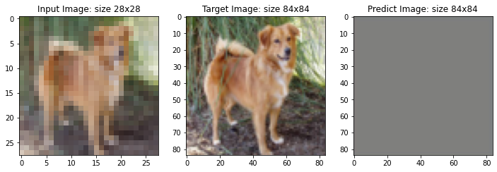

<a href="https://colab.research.google.com/github/giangdip2410/Research-Stuff/blob/main/CPSC5440_Assigment3_JGM667.ipynb" target="_parent"></a>

**Introduction to Autoencoder**

### Library 


```python
from collections import defaultdict
import copy
import random
import os
import shutil
from urllib.request import urlretrieve
import numpy as np
import albumentations as A
from albumentations.pytorch import ToTensorV2
import cv2
import matplotlib.pyplot as plt
from tqdm.notebook import tqdm
import torch
import torch.backends.cudnn as cudnn
import torch.nn as nn
import torch.nn.functional as F
import torch.optim
from torch.utils.data import Dataset, DataLoader
# from torchvision.transforms.autoaugment import InterpolationMode
import torchvision.models as models
from tqdm import tqdm
from multiprocessing import Pool
cudnn.benchmark = True
from torchsummary import summary
import pickle
import torch.optim as optim
import albumentations as A
from albumentations.pytorch import ToTensorV2
import torchvision
import warnings
from PIL import Image
warnings.filterwarnings('ignore')
```

### Config


```python
LEANRING_RATE = 0.001
input_size = (28, 28)
up_scale_ratio = 3
target_size = (28 * up_scale_ratio, 28 * up_scale_ratio)
batch_size = 128
#device
device = torch.device("cuda:0" if torch.cuda.is_available() else "cpu")
epochs = 10
#data path
train_path = './data/train/'
test_path =  './data/test1/'
#fix seed
SEED = 42

random.seed(SEED)
np.random.seed(SEED)
torch.manual_seed(SEED)
torch.cuda.manual_seed(SEED)
torch.backends.cudnn.deterministic = True
```

### Data Preporcessing


```python
#plot image 
def plot_images(images):
    n_images = len(images)

    rows = int(np.sqrt(n_images))
    cols = int(np.sqrt(n_images))

    fig = plt.figure(figsize=(20, 15))
    for i in range(rows*cols):
        img = cv2.imread(images[i])
        img = cv2.cvtColor(img, cv2.COLOR_BGR2RGB)
        ax = fig.add_subplot(rows, cols, i+1)
        ax.set_title(f"Size of img: {img.shape}")
        ax.imshow(img, cmap='bone')
        ax.axis('off')
```


```python
#get image path
train_images_filepaths = [train_path + j for j in os.listdir(train_path)]
#correct image path
train_images_filepaths = [i for i in train_images_filepaths if cv2.imread(i) is not None]
test_images_filepaths = [test_path + j for j in os.listdir(test_path)]
test_images_filepaths = [i for i in test_images_filepaths if cv2.imread(i) is not None]
print("Number of training images: ", len(train_images_filepaths)) 
print("Number of testing images: ",len(test_images_filepaths))
#sample data
sample_plot = train_images_filepaths[:9]
```

    Number of training images:  13270
    Number of testing images:  1826


```python
#plot sample image
plot_images(sample_plot)
```


    

    


### Datasets


```python
#dataset
class ResolutionDataset(Dataset):
    def __init__(self, images_filepaths, transform=None, target_transform=None):
        self.images_filepaths = images_filepaths
        # self.target_filepaths = target_filepaths
        self.transform = transform
        self.target_transform = target_transform

    def __len__(self):
        return len(self.images_filepaths)

    def __getitem__(self, idx):
        image_filepath = self.images_filepaths[idx]
        image = Image.open(image_filepath)
        target = Image.open(image_filepath)
        if self.transform is not None:
            image = self.transform(image)
        
        # target images
        if self.target_transform is not None:
            target = self.target_transform(target)
        return image, target
```


```python
#data augmentation
train_transform = torchvision.transforms.Compose([
                                        torchvision.transforms.Resize((input_size[0],input_size[1])),
                                        torchvision.transforms.ToTensor()])

val_transform = torchvision.transforms.Compose([
                                        torchvision.transforms.Resize((input_size[0],input_size[1])),
                                        torchvision.transforms.ToTensor()])
target_transform = torchvision.transforms.Compose([
                                        torchvision.transforms.Resize((target_size[0],target_size[1])),
                                        torchvision.transforms.ToTensor()])
```


```python
#dataset
train_size = 0.9
train_idx = len(train_images_filepaths) * train_size
train_img_input, val_img_input  = train_images_filepaths[:int(train_idx)], train_images_filepaths[int(train_idx):]
#create dataset
train_dataset = ResolutionDataset(train_img_input, train_transform, target_transform)
valid_dataset = ResolutionDataset(val_img_input,  train_transform, target_transform)
test_dataset = ResolutionDataset(test_images_filepaths,train_transform, target_transform)
#dataloader
train_dataloader = DataLoader(train_dataset, batch_size=batch_size, shuffle=True)
valid_dataloader = DataLoader(valid_dataset, batch_size=batch_size, shuffle=False)
test_dataloader = DataLoader(test_dataset, batch_size=batch_size, shuffle=False)
```

### Model


```python
# Define Convolutional AutoEncoder Network
class AutoEncoder(nn.Module):
    def __init__(self):
        super(AutoEncoder, self).__init__()
        #encoder module
        self.encoder = torch.nn.Sequential(
            nn.Upsample(scale_factor=up_scale_ratio, mode='nearest'),
            nn.Conv2d(3, 64, 3, stride=1, padding=1),  
            nn.ReLU(True),
            nn.MaxPool2d(2, stride=1),
            nn.Conv2d(64, 16, 3, stride=1, padding=1),  
            nn.ReLU(True),
            nn.MaxPool2d(2, stride=1)  
        )
        #decoder module
        self.decoder = torch.nn.Sequential(
            nn.Upsample(scale_factor=1, mode='nearest'),
            nn.Conv2d(16, 64, 3, stride=1, padding=1),  
            nn.ReLU(True),
            nn.Upsample(scale_factor=1, mode='nearest'),
            nn.Conv2d(64, 3, 3, stride=1, padding=2),  
            nn.Sigmoid()
        )

    def forward(self, x):
        coded = self.encoder(x)
        decoded = self.decoder(coded)
        return decoded

model = AutoEncoder().to(device)
print(model)
```

    AutoEncoder(
      (encoder): Sequential(
        (0): Upsample(scale_factor=3.0, mode=nearest)
        (1): Conv2d(3, 64, kernel_size=(3, 3), stride=(1, 1), padding=(1, 1))
        (2): ReLU(inplace=True)
        (3): MaxPool2d(kernel_size=2, stride=1, padding=0, dilation=1, ceil_mode=False)
        (4): Conv2d(64, 16, kernel_size=(3, 3), stride=(1, 1), padding=(1, 1))
        (5): ReLU(inplace=True)
        (6): MaxPool2d(kernel_size=2, stride=1, padding=0, dilation=1, ceil_mode=False)
      )
      (decoder): Sequential(
        (0): Upsample(scale_factor=1.0, mode=nearest)
        (1): Conv2d(16, 64, kernel_size=(3, 3), stride=(1, 1), padding=(1, 1))
        (2): ReLU(inplace=True)
        (3): Upsample(scale_factor=1.0, mode=nearest)
        (4): Conv2d(64, 3, kernel_size=(3, 3), stride=(1, 1), padding=(2, 2))
        (5): Sigmoid()
      )
    )


```python
summary(model, (3, 28, 28))
```

    ----------------------------------------------------------------
            Layer (type)               Output Shape         Param #
    ================================================================
              Upsample-1            [-1, 3, 84, 84]               0
                Conv2d-2           [-1, 64, 84, 84]           1,792
                  ReLU-3           [-1, 64, 84, 84]               0
             MaxPool2d-4           [-1, 64, 83, 83]               0
                Conv2d-5           [-1, 16, 83, 83]           9,232
                  ReLU-6           [-1, 16, 83, 83]               0
             MaxPool2d-7           [-1, 16, 82, 82]               0
              Upsample-8           [-1, 16, 82, 82]               0
                Conv2d-9           [-1, 64, 82, 82]           9,280
                 ReLU-10           [-1, 64, 82, 82]               0
             Upsample-11           [-1, 64, 82, 82]               0
               Conv2d-12            [-1, 3, 84, 84]           1,731
              Sigmoid-13            [-1, 3, 84, 84]               0
    ================================================================
    Total params: 22,035
    Trainable params: 22,035
    Non-trainable params: 0
    ----------------------------------------------------------------
    Input size (MB): 0.01
    Forward/backward pass size (MB): 23.91
    Params size (MB): 0.08
    Estimated Total Size (MB): 24.01
    ----------------------------------------------------------------


### Loss function and Optimization


```python
criterion = nn.MSELoss()
optimizer = optim.AdamW(model.parameters(), lr= LEANRING_RATE)
```

### Training Model


```python
def train_autoencoder(model,train_dataloader, test_dataloader, epochs):
    # set to training mode
    model.train()

    train_loss_avg = []
    valid_loss_avg = []
    best_loss = 1000
    print('====================== Start Training Autoencoder =====================')
    for epoch in range(epochs):
        train_loss_avg.append(0)
        num_batches = 0
        
        for image_batch, target_batch in tqdm(train_dataloader):
            
            image_batch = image_batch.to(device)
            target_batch = target_batch.to(device)
            # autoencoder reconstruction
            image_batch_recon = model(image_batch)
            
            # reconstruction error
            loss = criterion(image_batch_recon, target_batch)
            
            # backpropagation
            optimizer.zero_grad()
            loss.backward()
            
            # one step of the optmizer (using the gradients from backpropagation)
            optimizer.step()
            
            train_loss_avg[-1] += loss.item()
            num_batches += 1
            
        train_loss_avg[-1] /= num_batches
        print('Epoch [%d / %d] Training Loss: %f' % (epoch+1, epochs, train_loss_avg[-1]))
        # set to evaluation mode
        model.eval()

        test_loss_avg, num_batches = 0, 0
        valid_loss_avg.append(0)
        for image_batch, target_batch in tqdm(test_dataloader):
            
            with torch.no_grad():

                image_batch = image_batch.to(device)
                target_batch = target_batch.to(device)

                # autoencoder reconstruction
                image_batch_recon = model(image_batch)
                # reconstruction error
                loss = criterion(image_batch_recon, target_batch)

                test_loss_avg += loss.item()
                num_batches += 1
        
        test_loss_avg /= num_batches
        valid_loss_avg[-1] = test_loss_avg
        if test_loss_avg < best_loss:
            best_loss = test_loss_avg
            torch.save(model.state_dict(), "conv_autoencoder_best.pt")
        print('Epoch [%d / %d] Valid Loss: %f' % (epoch+1, epochs, test_loss_avg))
    return model, train_loss_avg, valid_loss_avg
```


```python
model, train_loss, valid_loss = train_autoencoder(model,train_dataloader, test_dataloader, epochs)
```

    ====================== Start Training Autoencoder =====================


    100%|██████████| 94/94 [00:59<00:00,  1.57it/s]


    Epoch [1 / 10] Training Loss: 0.014334


    100%|██████████| 15/15 [00:07<00:00,  1.96it/s]


    Epoch [1 / 10] Valid Loss: 0.005057


    100%|██████████| 94/94 [00:58<00:00,  1.61it/s]


    Epoch [2 / 10] Training Loss: 0.004550


    100%|██████████| 15/15 [00:07<00:00,  1.99it/s]


    Epoch [2 / 10] Valid Loss: 0.003430


    100%|██████████| 94/94 [00:58<00:00,  1.61it/s]


    Epoch [3 / 10] Training Loss: 0.003479


    100%|██████████| 15/15 [00:07<00:00,  1.98it/s]


    Epoch [3 / 10] Valid Loss: 0.003045


    100%|██████████| 94/94 [00:58<00:00,  1.61it/s]


    Epoch [4 / 10] Training Loss: 0.003192


    100%|██████████| 15/15 [00:07<00:00,  1.98it/s]


    Epoch [4 / 10] Valid Loss: 0.003064


    100%|██████████| 94/94 [00:58<00:00,  1.62it/s]


    Epoch [5 / 10] Training Loss: 0.003098


    100%|██████████| 15/15 [00:07<00:00,  1.97it/s]


    Epoch [5 / 10] Valid Loss: 0.002738


    100%|██████████| 94/94 [00:58<00:00,  1.60it/s]


    Epoch [6 / 10] Training Loss: 0.003012


    100%|██████████| 15/15 [00:07<00:00,  1.98it/s]


    Epoch [6 / 10] Valid Loss: 0.002678


    100%|██████████| 94/94 [00:58<00:00,  1.61it/s]


    Epoch [7 / 10] Training Loss: 0.002970


    100%|██████████| 15/15 [00:07<00:00,  1.98it/s]


    Epoch [7 / 10] Valid Loss: 0.002603


    100%|██████████| 94/94 [00:58<00:00,  1.61it/s]


    Epoch [8 / 10] Training Loss: 0.002827


    100%|██████████| 15/15 [00:07<00:00,  2.00it/s]


    Epoch [8 / 10] Valid Loss: 0.002582


    100%|██████████| 94/94 [00:58<00:00,  1.61it/s]


    Epoch [9 / 10] Training Loss: 0.002812


    100%|██████████| 15/15 [00:07<00:00,  2.00it/s]


    Epoch [9 / 10] Valid Loss: 0.002512


    100%|██████████| 94/94 [00:58<00:00,  1.61it/s]


    Epoch [10 / 10] Training Loss: 0.002783


    100%|██████████| 15/15 [00:07<00:00,  1.98it/s]

    Epoch [10 / 10] Valid Loss: 0.002834


    


```python
#plot train plot and valid loss
plt.plot(range(1,epochs+1), train_loss, label='Training Loss', color="#000")
plt.plot(range(1,epochs+1), valid_loss, label='Validation Loss', color="#852")
 
# Add in a title and axes labels
plt.title('Training and Validation Loss')
plt.xlabel('Epochs')
plt.ylabel('Loss')
 
# Set the tick locations
plt.xticks(range(0, epochs+1, 2))
 
# Display the plot
plt.legend(loc='best')
plt.show()
```


    

    


### Testing Model


```python
def convert_img(img):
    """Imshow for Tensor."""
    try:
        img = img.cpu().numpy().transpose((1, 2, 0)) 
    except:
        img = img.cpu().detach().numpy().transpose((1, 2, 0)) 
    return img

#load best model
model.load_state_dict(torch.load('conv_autoencoder_best.pt'))
#save reconstruction images
if not os.path.exists('output_autoencoder'):
    os.mkdir('output_autoencoder')
#plot reconstruction images
list_idx = [7, 19 , 24]
for i in range(len(list_idx)):
    ix = list_idx[i]
    img, target = valid_dataset[ix]
    img_predict = model(img[None].to(device))[0]
    img = convert_img(img)
    target = convert_img(target)
    img_predict = convert_img(img_predict)
    #save output
    print(img_predict.shape)
    Image.fromarray(np.uint8(img_predict*255)).convert('RGB').save(f"output_autoencoder/reconstruction_img_{i}.png")
    fig, ax = plt.subplots(1, 3, figsize=(12,12))
    ax[0].imshow(img)
    ax[0].set_title(f'Input Image: size {img.shape[0]}x{img.shape[0]}')
    ax[1].imshow(target)
    ax[1].set_title(f'Target Image: size {target.shape[0]}x{target.shape[0]}')
    ax[2].imshow(img_predict)
    ax[2].set_title(f'Predict Image: size {img_predict.shape[0]}x{img_predict.shape[0]}')
    plt.show()
```

    (84, 84, 3)


    

    


    (84, 84, 3)


    

    


    (84, 84, 3)


    

    


### Subjective grading of the quality of output

**With simple Autoencoder moedl (22,035) parameters model can generate very good image at scale (84x84) compare to input image (28x28). If we use more complex Autoencoder model such as using pretrained CNN model as an encoder part, we can improve generating images results**

### Try Another Model: Variational Autoencoder (VAE) 


```python
# VAE design model
class VAE(nn.Module):
    def __init__(self, z_dim=64, input_c=3):
        super(VAE, self).__init__()

        self.z_dim = z_dim
        #encoder module
        self.encoder = torch.nn.Sequential(
            nn.Upsample(scale_factor=up_scale_ratio, mode='nearest'),
            nn.Conv2d(3, 64, 3, stride=2, padding=1),  
            nn.ReLU(True),
            nn.MaxPool2d(2, stride=1),
            nn.Conv2d(64, 16, 3, stride=4, padding=1),  
            nn.ReLU(True),
            nn.Conv2d(16, 16, 3, stride=4, padding=1),  
            nn.ReLU(True),
            nn.MaxPool2d(2, stride=1)  
        )
    
        
        self.mu_fc = nn.Linear(z_dim, z_dim)
        self.logvar_fc = nn.Linear(z_dim, z_dim)

       #decoder module
        self.decoder = torch.nn.Sequential(
            nn.Upsample(scale_factor=84, mode='nearest'),
            nn.Conv2d(64, 16, 3, stride=1),  
            nn.ReLU(True),
            nn.Conv2d(16, 64, 3, stride=1, padding=1),  
            nn.ReLU(True),
            nn.Upsample(scale_factor=1, mode='nearest'),
            nn.Conv2d(64, 3, 3, stride=1, padding=2),  
            nn.Sigmoid()
        )

    def initialize(self):
        for m in self.modules():
            if isinstance(m, nn.Conv2d):
                nn.init.kaiming_normal_(m.weight)
                if m.bias is not None:
                    nn.init.constant_(m.bias, 0)
            elif isinstance(m, nn.BatchNorm2d) or isinstance(m, nn.LayerNorm):
                nn.init.constant_(m.weight, 1)
                nn.init.constant_(m.bias, 0)
            elif isinstance(m, nn.Linear):
                nn.init.xavier_uniform_(m.weight)
                nn.init.constant_(m.bias, 0)
        
    def reparameterize(self, mu, logvar):
        std = torch.exp(0.5*logvar)
        eps = torch.randn_like(std)
        return mu + eps*std

    def forward(self, x):
        h      = self.encoder(x)
        h = torch.flatten(h, start_dim=1)
        mu     = self.mu_fc(h)                    # mean vector 
        logvar = self.logvar_fc(h)                # logarithm of variance-covariance matrix
        z      = self.reparameterize(mu, logvar)  # latent variable 
        x_hat  = self.decoder(z.view(z.size(0), -1, 1, 1))
        self.mu     = mu.squeeze()
        self.logvar = logvar.squeeze()
        return x_hat
```


```python
model2 = VAE().to(device)
summary(model2, (3, 28, 28))
```

    ----------------------------------------------------------------
            Layer (type)               Output Shape         Param #
    ================================================================
              Upsample-1            [-1, 3, 84, 84]               0
                Conv2d-2           [-1, 64, 42, 42]           1,792
                  ReLU-3           [-1, 64, 42, 42]               0
             MaxPool2d-4           [-1, 64, 41, 41]               0
                Conv2d-5           [-1, 16, 11, 11]           9,232
                  ReLU-6           [-1, 16, 11, 11]               0
                Conv2d-7             [-1, 16, 3, 3]           2,320
                  ReLU-8             [-1, 16, 3, 3]               0
             MaxPool2d-9             [-1, 16, 2, 2]               0
               Linear-10                   [-1, 64]           4,160
               Linear-11                   [-1, 64]           4,160
             Upsample-12           [-1, 64, 84, 84]               0
               Conv2d-13           [-1, 16, 82, 82]           9,232
                 ReLU-14           [-1, 16, 82, 82]               0
               Conv2d-15           [-1, 64, 82, 82]           9,280
                 ReLU-16           [-1, 64, 82, 82]               0
             Upsample-17           [-1, 64, 82, 82]               0
               Conv2d-18            [-1, 3, 84, 84]           1,731
              Sigmoid-19            [-1, 3, 84, 84]               0
    ================================================================
    Total params: 41,907
    Trainable params: 41,907
    Non-trainable params: 0
    ----------------------------------------------------------------
    Input size (MB): 0.01
    Forward/backward pass size (MB): 18.00
    Params size (MB): 0.16
    Estimated Total Size (MB): 18.17
    ----------------------------------------------------------------


```python
def train_vae(model,train_dataloader, test_dataloader, epochs):
    # set to training mode
    model.train()

    train_loss_avg = []
    valid_loss_avg = []
    best_loss = 1000
    print('====================== Start Training Variational Autoencoder =====================')
    for epoch in range(epochs):
        train_loss_avg.append(0)
        num_batches = 0
        
        for image_batch, target_batch in tqdm(train_dataloader):
            
            image_batch = image_batch.to(device)
            target_batch = target_batch.to(device)
            # autoencoder reconstruction
            image_batch_recon = model(image_batch)
            
            # reconstruction error
            loss = criterion(image_batch_recon, target_batch)
            
            # backpropagation
            optimizer.zero_grad()
            loss.backward()
            
            # one step of the optmizer (using the gradients from backpropagation)
            optimizer.step()
            
            train_loss_avg[-1] += loss.item()
            num_batches += 1
            
        train_loss_avg[-1] /= num_batches
        print('Epoch [%d / %d] Training Loss: %f' % (epoch+1, epochs, train_loss_avg[-1]))
        # set to evaluation mode
        model.eval()

        test_loss_avg, num_batches = 0, 0
        valid_loss_avg.append(0)
        for image_batch, target_batch in tqdm(test_dataloader):
            
            with torch.no_grad():

                image_batch = image_batch.to(device)
                target_batch = target_batch.to(device)

                # autoencoder reconstruction
                image_batch_recon = model(image_batch)
                # reconstruction error
                loss = criterion(image_batch_recon, target_batch)

                test_loss_avg += loss.item()
                num_batches += 1
        
        test_loss_avg /= num_batches
        valid_loss_avg[-1] = test_loss_avg
        if test_loss_avg < best_loss:
            best_loss = test_loss_avg
            torch.save(model.state_dict(), "VAE_best.pt")
        print('Epoch [%d / %d] Valid Loss: %f' % (epoch+1, epochs, test_loss_avg))
    return model, train_loss_avg, valid_loss_avg
```


```python
criterion = nn.MSELoss()
optimizer = optim.AdamW(model.parameters(), lr= LEANRING_RATE)
```


```python
model2, train_loss2, valid_loss2 = train_vae(model2,train_dataloader, test_dataloader, epochs)
```

    ====================== Start Training Variational Autoencoder =====================


    100%|██████████| 94/94 [01:00<00:00,  1.56it/s]


    Epoch [1 / 10] Training Loss: 0.062646


    100%|██████████| 15/15 [00:07<00:00,  2.03it/s]


    Epoch [1 / 10] Valid Loss: 0.064426


    100%|██████████| 94/94 [01:00<00:00,  1.56it/s]


    Epoch [2 / 10] Training Loss: 0.062700


    100%|██████████| 15/15 [00:07<00:00,  2.02it/s]


    Epoch [2 / 10] Valid Loss: 0.064400


    100%|██████████| 94/94 [00:59<00:00,  1.57it/s]


    Epoch [3 / 10] Training Loss: 0.062614


    100%|██████████| 15/15 [00:07<00:00,  2.02it/s]


    Epoch [3 / 10] Valid Loss: 0.064505


    100%|██████████| 94/94 [01:00<00:00,  1.56it/s]


    Epoch [4 / 10] Training Loss: 0.062682


    100%|██████████| 15/15 [00:07<00:00,  2.00it/s]


    Epoch [4 / 10] Valid Loss: 0.064457


    100%|██████████| 94/94 [01:00<00:00,  1.55it/s]


    Epoch [5 / 10] Training Loss: 0.062549


    100%|██████████| 15/15 [00:07<00:00,  2.00it/s]


    Epoch [5 / 10] Valid Loss: 0.064379


    100%|██████████| 94/94 [01:00<00:00,  1.55it/s]


    Epoch [6 / 10] Training Loss: 0.062671


    100%|██████████| 15/15 [00:07<00:00,  2.02it/s]


    Epoch [6 / 10] Valid Loss: 0.064328


    100%|██████████| 94/94 [01:00<00:00,  1.55it/s]


    Epoch [7 / 10] Training Loss: 0.062634


    100%|██████████| 15/15 [00:07<00:00,  2.00it/s]


    Epoch [7 / 10] Valid Loss: 0.064389


    100%|██████████| 94/94 [01:00<00:00,  1.55it/s]


    Epoch [8 / 10] Training Loss: 0.062643


    100%|██████████| 15/15 [00:07<00:00,  2.00it/s]


    Epoch [8 / 10] Valid Loss: 0.064393


    100%|██████████| 94/94 [01:00<00:00,  1.56it/s]


    Epoch [9 / 10] Training Loss: 0.062568


    100%|██████████| 15/15 [00:07<00:00,  2.00it/s]


    Epoch [9 / 10] Valid Loss: 0.064448


    100%|██████████| 94/94 [01:00<00:00,  1.55it/s]


    Epoch [10 / 10] Training Loss: 0.062619


    100%|██████████| 15/15 [00:07<00:00,  2.01it/s]

    Epoch [10 / 10] Valid Loss: 0.064398


    


```python
# Testing with VAE model
#load best model
model2.load_state_dict(torch.load('VAE_best.pt'))
#save reconstruction images
if not os.path.exists('output_VAE'):
    os.mkdir('output_VAE')
#plot reconstruction images
list_idx = [7, 19 , 24]
for i in range(len(list_idx)):
    ix = list_idx[i]
    img, target = valid_dataset[ix]
    img_predict = model2(img[None].to(device))[0]
    img = convert_img(img)
    target = convert_img(target)
    img_predict = convert_img(img_predict)
    #save output
    Image.fromarray(np.uint8(img_predict*255)).convert('RGB').save(f"output_VAE/reconstruction_img_{i}.png")
    fig, ax = plt.subplots(1, 3, figsize=(12,12))
    ax[0].imshow(img)
    ax[0].set_title(f'Input Image: size {img.shape[0]}x{img.shape[0]}')
    ax[1].imshow(target)
    ax[1].set_title(f'Target Image: size {target.shape[0]}x{target.shape[0]}')
    ax[2].imshow(img_predict)
    ax[2].set_title(f'Predict Image: size {img_predict.shape[0]}x{img_predict.shape[0]}')
    plt.show()
```


    

    


    

    


    

    


### Conclusion

**Variational Autoencoder model with more complex architecture but the generating results are not good as Convolution Autoencoder model.**


```python

```


```python

```
