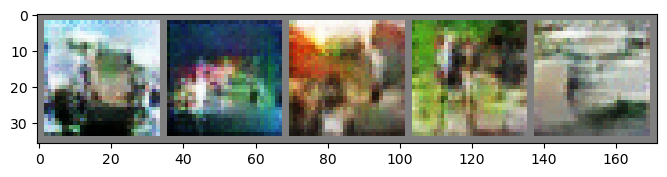

<a href="https://colab.research.google.com/github/giangdip2410/Research-Stuff/blob/main/CPSC5440_Assigment5_JGM667.ipynb" target="_parent"></a>

**Introduction to GAN**

**In this notebook, I will experiment various types of GAN model with PyTorch which benchmark on CIFAR-10 dataset. The models will be able to generate new image after training on the dataset. Datasets available at: https://paperswithcode.com/sota/image-generation-on-cifar-10**

### Library 


```python
from collections import defaultdict
import copy
import random
import os
import shutil
from urllib.request import urlretrieve
import numpy as np
import matplotlib.pyplot as plt
from tqdm.notebook import tqdm
import torch
import torch.backends.cudnn as cudnn
import torch.nn as nn
import torch.nn.functional as F
from torch import optim
from torch.utils.data import Dataset, DataLoader
from torchvision.datasets import CIFAR10
import torchvision.transforms as transforms
from torchvision.utils import make_grid
from tqdm.notebook import tqdm
from multiprocessing import Pool
cudnn.benchmark = True
from torchsummary import summary
import pickle
import pandas as pd
import time
import random
```


```python
#fix seed for stable training
SEED = 42

random.seed(SEED)
np.random.seed(SEED)
torch.manual_seed(SEED)
torch.cuda.manual_seed(SEED)
torch.backends.cudnn.deterministic = True
```

### Config


```python
learning_rate = 0.0002
#device
device = torch.device("cuda:0" if torch.cuda.is_available() else "cpu")
n_epoch = 30
n_critic = 4
batch_size = 32
num_workers = 2
img_size = 32 * 32 * 3
latent_dim = 100
```

### Data Preporcessing


```python
# simple transform
transform = transforms.Compose([transforms.ToTensor(), transforms.Normalize((0.5, 0.5, 0.5), (0.5, 0.5, 0.5))])
#dataset
train_data = CIFAR10(root='./data', train=True, download=True, transform=transform)
training_data  = DataLoader(train_data, batch_size=batch_size, shuffle=True, num_workers= num_workers)
test_data = CIFAR10(root='./data', train=False, download=True, transform=transform)
testing_data  = torch.utils.data.DataLoader(test_data, batch_size=4, shuffle=False, num_workers=2)
# classes
classes = ('plane', 'car', 'bird', 'cat', 'deer', 'dog', 'frog', 'horse', 'ship', 'truck')
```

    Files already downloaded and verified
    Files already downloaded and verified


```python
# show sample image
def imshow(img):
    plt.figure(figsize=(8, 16))
    img = img / 2 + 0.5     # unnormalize
    npimg = img.numpy()
    plt.imshow(np.transpose(npimg, (1, 2, 0)))
    plt.show()


# get some random training images
dataiter = iter(training_data)
images, labels = next(iter(training_data))

# show images
num_show = 5
imshow(make_grid(images[:num_show]))
# print labels
print('              '.join('%5s' % classes[labels[j]] for j in range(num_show)))
```


    

    


     ship              horse                car               frog               bird


### Model 1: GAN-MLP

#### Discriminator


```python
class Discriminator(nn.Module):
    def __init__(self, input_size=img_size):
        super(Discriminator, self).__init__()
        self.mlp = nn.Sequential(
            nn.Linear(32 * 32 * 3, 512),
            nn.ReLU(inplace=True),
            nn.Linear(512, 256),
            nn.ReLU(inplace=True),
            nn.Linear(256, 1)
        )
    def forward(self, x):
        x = x.reshape(x.shape[0], -1)
        x = self.mlp(x)
        return x
```

#### Generator


```python
class Generator(nn.Module):
    def __init__(self, latent_dim=latent_dim,  output_size=img_size):
        super(Generator, self).__init__()
        self.mlp = nn.Sequential(
            nn.Linear(latent_dim, 256),
            nn.ReLU(inplace=True),
            nn.Linear(256, 512),
            nn.ReLU(inplace=True),
            nn.Linear(512, output_size)
        )
    def forward(self, x):
        x = x.reshape(x.shape[0], -1)
        x = self.mlp(x)
        return x
```

#### Optimization


```python
#model
D = Discriminator().to(device)
G = Generator().to(device)
#loss funcgion
criterion = nn.BCEWithLogitsLoss()
#optimization
opt_g = optim.Adam(G.parameters(), lr=learning_rate, betas=(0.5, 0.999))
opt_d = optim.Adam(D.parameters(), lr=learning_rate, betas=(0.5, 0.999))
```

#### Training function


```python
def epoch_time(start_time, end_time):
    elapsed_time = end_time - start_time
    elapsed_mins = int(elapsed_time / 60)
    elapsed_secs = int(elapsed_time - (elapsed_mins * 60))
    return elapsed_mins, elapsed_secs
```


```python
def training(D, G, criterion, opt_d, opt_g, latent_dim, training_data, n_epoch, n_critic, freq_save=5, model_type='MLP'):
    for epoch in tqdm(range(1, n_epoch + 1)):
        # put train mode
        G.train()
        D.train()
        start_time = time.monotonic()
        for real_x, _ in training_data:
            real_x = real_x.to(device)
            batch = real_x.size(0)
            #label for real/fake
            if model_type == 'MLP':
                flag_real = torch.ones([batch, 1],  dtype=torch.float64).to(device)
                flag_fake = torch.zeros([batch, 1],  dtype=torch.float64).to(device)
            elif model_type == 'CNN':
                flag_real = torch.ones([batch],  dtype=torch.float64).to(device)
                flag_fake = torch.zeros([batch],  dtype=torch.float64).to(device)
            # training D
            for _ in range(n_critic):
                D.zero_grad()
                if model_type == 'MLP':
                    z = torch.randn(batch, latent_dim).to(device)
                elif model_type == 'CNN':
                    z = torch.randn(batch, latent_dim, 1, 1).to(device)
                #generate image
                fake_x = G(z)
                # output real
                out_real = D(real_x)
                out_fake = D(fake_x)
                # loss real and fake
                loss_real = criterion(out_real, flag_real)
                loss_fake = criterion(out_fake, flag_fake)
                # discriminator loss 
                t_loss = loss_real + loss_fake
                t_loss.backward()
                #update weights D
                opt_d.step()
            # training G
            G.zero_grad()
            # start with noise
            if model_type == 'MLP':
                z = torch.randn(batch, latent_dim).to(device)
            elif model_type == 'CNN':
                z = torch.randn(batch, latent_dim, 1, 1).to(device)
            # z = torch.randn(batch, latent_dim).to(device)
            # fake images
            fake_x = G(z)
            # predict for fake images
            out_gen = D(fake_x)
            # gen loss
            gen_loss = criterion(out_gen, flag_real)
            gen_loss.backward()
            # update weights G
            opt_g.step()
        end_time = time.monotonic()
        #log loss
        epoch_mins, epoch_secs = epoch_time(start_time, end_time)
        print(f'Epoch: {epoch:02} | Epoch Time: {epoch_mins}m {epoch_secs}s')
        print(f'\tDiscriminator Loss: {t_loss.item():.3f} ')
        print(f'\tGenerator Loss: {gen_loss.item():.3f} ')
        #save weights
        if (epoch % freq_save == 0) or (epoch == 1):
            gen_img = fake_x.detach().cpu()
            gen_img = gen_img.reshape(-1, 3, 32, 32)
            imshow(make_grid(gen_img[:5]))
            torch.save(G.state_dict(), f"{model_type}_G_%04d.pt" % epoch)
            torch.save(D.state_dict(), f"{model_type}_D_%04d.pt" % epoch)
```


```python
#start training
training(D, G, criterion, opt_d, opt_g, latent_dim, training_data, n_epoch, n_critic)
```


      0%|          | 0/30 [00:00<?, ?it/s]


    Clipping input data to the valid range for imshow with RGB data ([0..1] for floats or [0..255] for integers).


    Epoch: 01 | Epoch Time: 0m 28s
    	Discriminator Loss: 0.008 
    	Generator Loss: 6.124 


    

    


    Epoch: 02 | Epoch Time: 0m 29s
    	Discriminator Loss: 0.011 
    	Generator Loss: 6.455 
    Epoch: 03 | Epoch Time: 0m 27s
    	Discriminator Loss: 0.004 
    	Generator Loss: 5.924 
    Epoch: 04 | Epoch Time: 0m 23s
    	Discriminator Loss: 0.030 
    	Generator Loss: 7.780 
    Epoch: 05 | Epoch Time: 0m 26s
    	Discriminator Loss: 0.135 
    	Generator Loss: 4.733 


    Clipping input data to the valid range for imshow with RGB data ([0..1] for floats or [0..255] for integers).


    Epoch: 06 | Epoch Time: 0m 25s
    	Discriminator Loss: 0.059 
    	Generator Loss: 4.474 


    

    


    Epoch: 07 | Epoch Time: 0m 27s
    	Discriminator Loss: 0.089 
    	Generator Loss: 5.345 
    Epoch: 08 | Epoch Time: 0m 24s
    	Discriminator Loss: 0.070 
    	Generator Loss: 4.423 
    Epoch: 09 | Epoch Time: 0m 27s
    	Discriminator Loss: 0.222 
    	Generator Loss: 3.542 
    Epoch: 10 | Epoch Time: 0m 26s
    	Discriminator Loss: 0.276 
    	Generator Loss: 3.533 


    Clipping input data to the valid range for imshow with RGB data ([0..1] for floats or [0..255] for integers).


    Epoch: 11 | Epoch Time: 0m 27s
    	Discriminator Loss: 0.204 
    	Generator Loss: 2.726 


    

    


    Epoch: 12 | Epoch Time: 0m 27s
    	Discriminator Loss: 0.169 
    	Generator Loss: 3.144 
    Epoch: 13 | Epoch Time: 0m 26s
    	Discriminator Loss: 0.383 
    	Generator Loss: 1.990 
    Epoch: 14 | Epoch Time: 0m 26s
    	Discriminator Loss: 0.186 
    	Generator Loss: 2.276 
    Epoch: 15 | Epoch Time: 0m 28s
    	Discriminator Loss: 0.187 
    	Generator Loss: 2.740 


    Clipping input data to the valid range for imshow with RGB data ([0..1] for floats or [0..255] for integers).


    Epoch: 16 | Epoch Time: 0m 28s
    	Discriminator Loss: 0.395 
    	Generator Loss: 2.919 


    

    


    Epoch: 17 | Epoch Time: 0m 22s
    	Discriminator Loss: 0.483 
    	Generator Loss: 2.390 
    Epoch: 18 | Epoch Time: 0m 29s
    	Discriminator Loss: 0.288 
    	Generator Loss: 2.797 
    Epoch: 19 | Epoch Time: 0m 28s
    	Discriminator Loss: 0.246 
    	Generator Loss: 2.814 
    Epoch: 20 | Epoch Time: 0m 27s
    	Discriminator Loss: 0.176 
    	Generator Loss: 2.237 


    Clipping input data to the valid range for imshow with RGB data ([0..1] for floats or [0..255] for integers).


    Epoch: 21 | Epoch Time: 0m 23s
    	Discriminator Loss: 0.430 
    	Generator Loss: 2.027 


    

    


    Epoch: 22 | Epoch Time: 0m 28s
    	Discriminator Loss: 0.589 
    	Generator Loss: 2.444 
    Epoch: 23 | Epoch Time: 0m 23s
    	Discriminator Loss: 0.602 
    	Generator Loss: 2.414 
    Epoch: 24 | Epoch Time: 0m 25s
    	Discriminator Loss: 0.381 
    	Generator Loss: 3.128 
    Epoch: 25 | Epoch Time: 0m 28s
    	Discriminator Loss: 0.250 
    	Generator Loss: 1.678 


    Clipping input data to the valid range for imshow with RGB data ([0..1] for floats or [0..255] for integers).


    Epoch: 26 | Epoch Time: 0m 21s
    	Discriminator Loss: 0.176 
    	Generator Loss: 2.426 


    

    


    Epoch: 27 | Epoch Time: 0m 28s
    	Discriminator Loss: 0.271 
    	Generator Loss: 2.696 
    Epoch: 28 | Epoch Time: 0m 30s
    	Discriminator Loss: 0.710 
    	Generator Loss: 2.058 
    Epoch: 29 | Epoch Time: 0m 23s
    	Discriminator Loss: 0.305 
    	Generator Loss: 2.039 
    Epoch: 30 | Epoch Time: 0m 27s
    	Discriminator Loss: 0.375 
    	Generator Loss: 2.080 


### Predict function


```python
def generate_img(G, latent_dim, device, number_img=100):
    #random z
    z = torch.randn(number_img, latent_dim).to(device)
    # fake images
    fake_x = G(z)
    gen_img = fake_x.detach().cpu()
    gen_img = gen_img.reshape(-1, 3, 32, 32)
    return gen_img
```


```python
#load model generating
G.load_state_dict(torch.load("MLP_G_0026.pt"))
gen_img = generate_img(G, latent_dim, device, number_img=100)
```


```python
#visualize generate image
num_show = 5
imshow(make_grid(gen_img[:num_show]))
```

    Clipping input data to the valid range for imshow with RGB data ([0..1] for floats or [0..255] for integers).


    

    


### Model 2: Deep Convolutional GAN (DC-GAN)

#### Discriminator


```python
class Discriminator(nn.Module):
    def __init__(self, in_ch=3, img_size=32):
        super(Discriminator, self).__init__()
        n_layer = int(np.log2(img_size)) - 2
        self.model = nn.Sequential()
        features = 32
        self.model.add_module("Conv_first", nn.Conv2d(in_ch, features, 4, 2, 1, bias=True))
        self.model.add_module("Act_first", nn.LeakyReLU(negative_slope=0.2))
        in_features = features
        for i in range(n_layer):
            out_features = features * 2
            self.model.add_module('Conv%d' % i, nn.Conv2d(in_features, out_features, 4, 2, 1, bias=True))
            self.model.add_module('BN%d' % i, nn.BatchNorm2d(out_features))
            self.model.add_module('Act%d' % i, nn.LeakyReLU(negative_slope=0.2))
            in_features = out_features
        # last layer
        self.model.add_module('Conv_last', nn.Conv2d(in_features, 1, 2, 1, bias=True))
        self.weight_init()
    def weight_init(self):
        for m in self.model:
            if isinstance(m, nn.ConvTranspose2d) or isinstance(m, nn.Conv2d):
                m.weight.data.normal_(0.0, 0.02)
                m.bias.data.zero_()
    def forward(self, x):
        return self.model(x).view(-1)
```

#### Generator


```python
class Generator(nn.Module):
    def __init__(self, latent_dim=100, out_ch=3, img_size=32):
        super(Generator, self).__init__()
        n_layer = int(np.log2(img_size)) - 2
        self.model = nn.Sequential()
        
        features = 512
        self.model.add_module('Deconv_first', nn.ConvTranspose2d(latent_dim, features, 2,  2, bias=True))
        self.model.add_module('BN_first', nn.BatchNorm2d(features))
        self.model.add_module('Act_first', nn.ReLU(inplace=True))
        in_features = features
        for i in range(n_layer):
            out_features= in_features // 2
            self.model.add_module('Deconv%d' % i, nn.ConvTranspose2d(in_features, out_features, 4, 2, 1, bias=True))
            self.model.add_module('BN%d' % i, nn.BatchNorm2d(out_features))
            self.model.add_module('Act%d' % i, nn.ReLU(inplace=True))
            in_features = out_features
        #last layer
        self.model.add_module('Deconv_last', nn.ConvTranspose2d(in_features, out_ch, 2, 2, bias=True))
        self.model.add_module('Act_last', nn.Tanh())
        self.weight_init()
    def weight_init(self):
        for m in self.model:
            if isinstance(m, nn.ConvTranspose2d) or isinstance(m, nn.Conv2d):
                m.weight.data.normal_(0.0, 0.02)
                m.bias.data.zero_()
    
    def forward(self, z):
        return self.model(z)
```

#### Training 


```python
#model
D = Discriminator().to(device)
G = Generator().to(device)
#loss funcgion
criterion = nn.BCEWithLogitsLoss()
#optimization
opt_g = optim.Adam(G.parameters(), lr=learning_rate, betas=(0.5, 0.999))
opt_d = optim.Adam(D.parameters(), lr=learning_rate, betas=(0.5, 0.999))
```


```python
#start training
training(D, G, criterion, opt_d, opt_g, latent_dim, training_data, n_epoch, n_critic=20, model_type='CNN')
```


      0%|          | 0/20 [00:00<?, ?it/s]


    Epoch: 01 | Epoch Time: 0m 26s
    	Discriminator Loss: 1.538 
    	Generator Loss: 1.736 


    

    


    Epoch: 02 | Epoch Time: 0m 25s
    	Discriminator Loss: 0.786 
    	Generator Loss: 2.399 
    Epoch: 03 | Epoch Time: 0m 26s
    	Discriminator Loss: 0.333 
    	Generator Loss: 3.380 
    Epoch: 04 | Epoch Time: 0m 26s
    	Discriminator Loss: 0.914 
    	Generator Loss: 2.792 
    Epoch: 05 | Epoch Time: 0m 25s
    	Discriminator Loss: 0.484 
    	Generator Loss: 2.795 


    

    


    Epoch: 06 | Epoch Time: 0m 28s
    	Discriminator Loss: 0.355 
    	Generator Loss: 2.292 
    Epoch: 07 | Epoch Time: 0m 28s
    	Discriminator Loss: 0.486 
    	Generator Loss: 2.829 
    Epoch: 08 | Epoch Time: 0m 24s
    	Discriminator Loss: 0.918 
    	Generator Loss: 3.041 
    Epoch: 09 | Epoch Time: 0m 26s
    	Discriminator Loss: 1.595 
    	Generator Loss: 2.786 
    Epoch: 10 | Epoch Time: 0m 26s
    	Discriminator Loss: 1.277 
    	Generator Loss: 1.260 


    

    


    Epoch: 11 | Epoch Time: 0m 25s
    	Discriminator Loss: 0.260 
    	Generator Loss: 4.352 
    Epoch: 12 | Epoch Time: 0m 22s
    	Discriminator Loss: 0.855 
    	Generator Loss: 0.963 
    Epoch: 13 | Epoch Time: 0m 25s
    	Discriminator Loss: 0.430 
    	Generator Loss: 4.613 
    Epoch: 14 | Epoch Time: 0m 19s
    	Discriminator Loss: 0.197 
    	Generator Loss: 4.480 
    Epoch: 15 | Epoch Time: 0m 23s
    	Discriminator Loss: 0.242 
    	Generator Loss: 3.336 


    

    


    Epoch: 16 | Epoch Time: 0m 25s
    	Discriminator Loss: 0.894 
    	Generator Loss: 2.684 
    Epoch: 17 | Epoch Time: 0m 27s
    	Discriminator Loss: 1.070 
    	Generator Loss: 5.525 
    Epoch: 18 | Epoch Time: 0m 25s
    	Discriminator Loss: 0.422 
    	Generator Loss: 1.627 
    Epoch: 19 | Epoch Time: 0m 26s
    	Discriminator Loss: 0.655 
    	Generator Loss: 3.276 
    Epoch: 20 | Epoch Time: 0m 28s
    	Discriminator Loss: 1.469 
    	Generator Loss: 0.255 


    

    


#### Predict


```python
def generate_img(G, latent_dim, device, number_img=100, model_type='CNN'):
    #random z
    if model_type == 'MLP':
        z = torch.randn(number_img, latent_dim).to(device)
    elif model_type == 'CNN':
        z = torch.randn(number_img, latent_dim, 1, 1).to(device)
    # fake images
    fake_x = G(z)
    gen_img = fake_x.detach().cpu()
    gen_img = gen_img.reshape(-1, 3, 32, 32)
    return gen_img
```


```python
#load model generating
G.load_state_dict(torch.load("CNN_G_0020.pt"))
gen_img = generate_img(G, latent_dim, device, number_img=100, model_type='CNN')
```


```python
#visualize generate image
num_show = 5
imshow(make_grid(gen_img[:num_show]))
```


    

    


**Comparing with MLP-GAN, DC-GAN show better loss results after 20 epochs. As a result, generating images show better images with more detail about color and object.**

### Conditional DC-GAN

#### Discriminator


```python
class Discriminator(nn.Module):
    def __init__(self, in_ch=3, num_class=10, img_size=32):
        super(Discriminator, self).__init__()
        n_layer = int(np.log2(img_size)) - 2
        self.model = nn.Sequential()
        features = 32
        self.model.add_module("Conv_first", nn.Conv2d(in_ch+num_class, features, 4, 2, 1, bias=True))
        self.model.add_module("Act_first", nn.LeakyReLU(negative_slope=0.2))
        in_features = features
        for i in range(n_layer):
            out_features = features * 2
            self.model.add_module('Conv%d' % i, nn.Conv2d(in_features, out_features, 4, 2, 1, bias=True))
            self.model.add_module('BN%d' % i, nn.BatchNorm2d(out_features))
            self.model.add_module('Act%d' % i, nn.LeakyReLU(negative_slope=0.2))
            in_features = out_features
        # last layer
        self.model.add_module('Conv_last', nn.Conv2d(in_features, 1, 2, 1, bias=True))
        self.weight_init()
    def weight_init(self):
        for m in self.model:
            if isinstance(m, nn.ConvTranspose2d) or isinstance(m, nn.Conv2d):
                m.weight.data.normal_(0.0, 0.02)
                m.bias.data.zero_()
    def forward(self, x):
        return self.model(x).view(-1)
```

#### Generator


```python
class Generator(nn.Module):
    def __init__(self, latent_dim=100, num_class=10, out_ch=3, img_size=32):
        super(Generator, self).__init__()
        n_layer = int(np.log2(img_size)) - 2
        self.model = nn.Sequential()
        
        features = 512
        self.model.add_module('Deconv_first', nn.ConvTranspose2d(latent_dim+num_class, features, 2,  2, bias=True))
        self.model.add_module('BN_first', nn.BatchNorm2d(features))
        self.model.add_module('Act_first', nn.ReLU(inplace=True))
        in_features = features
        for i in range(n_layer):
            out_features= in_features // 2
            self.model.add_module('Deconv%d' % i, nn.ConvTranspose2d(in_features, out_features, 4, 2, 1, bias=True))
            self.model.add_module('BN%d' % i, nn.BatchNorm2d(out_features))
            self.model.add_module('Act%d' % i, nn.ReLU(inplace=True))
            in_features = out_features
        #last layer
        self.model.add_module('Deconv_last', nn.ConvTranspose2d(in_features, out_ch, 2, 2, bias=True))
        self.model.add_module('Act_last', nn.Tanh())
        self.weight_init()
    def weight_init(self):
        for m in self.model:
            if isinstance(m, nn.ConvTranspose2d) or isinstance(m, nn.Conv2d):
                m.weight.data.normal_(0.0, 0.02)
                m.bias.data.zero_()
    
    def forward(self, z):
        return self.model(z)
```


```python
#model
D = Discriminator().to(device)
G = Generator().to(device)
#loss funcgion
criterion = nn.BCEWithLogitsLoss()
#optimization
opt_g = optim.Adam(G.parameters(), lr=learning_rate, betas=(0.5, 0.999))
opt_d = optim.Adam(D.parameters(), lr=learning_rate, betas=(0.5, 0.999))
```


```python
def training_condition(D, G, criterion, opt_d, opt_g, latent_dim, training_data, n_epoch, n_critic, freq_save=5, num_class=10, model_type='CNN'):
    for epoch in tqdm(range(1, n_epoch + 1)):
        # put train mode
        G.train()
        D.train()
        start_time = time.monotonic()
        for real_x, y in training_data:
            real_x = real_x.to(device)
            #one hot
            onehot = torch.eye(num_class)[y].to(device)[:, :, None, None]
            batch = real_x.size(0)
            onehot_expand = onehot.expand(batch, onehot.size(1), real_x.size(2), real_x.size(3))
            #label for real/fake
            if model_type == 'MLP':
                flag_real = torch.ones([batch, 1],  dtype=torch.float64).to(device)
                flag_fake = torch.zeros([batch, 1],  dtype=torch.float64).to(device)
            elif model_type == 'CNN':
                flag_real = torch.ones([batch],  dtype=torch.float64).to(device)
                flag_fake = torch.zeros([batch],  dtype=torch.float64).to(device)
            # training D
            for _ in range(n_critic):
                D.zero_grad()
                if model_type == 'MLP':
                    z = torch.randn(batch, latent_dim+num_class).to(device)
                elif model_type == 'CNN':
                    z = torch.randn(batch, latent_dim+num_class, 1, 1).to(device)
                #generate image
                z[:, :num_class] = onehot
                fake_x = G(z)
                _real_x =  torch.cat((real_x, onehot_expand), dim=1)
                _fake_x = torch.cat((fake_x, onehot_expand), dim=1)
                # output real
                out_real = D(_real_x)
                out_fake = D(_fake_x)
                # loss real and fake
                loss_real = criterion(out_real, flag_real)
                loss_fake = criterion(out_fake, flag_fake)
                # discriminator loss 
                t_loss = loss_real + loss_fake
                t_loss.backward()
                #update weights D
                opt_d.step()
            # training G
            G.zero_grad()
            # start with noise
            if model_type == 'MLP':
                z = torch.randn(batch, latent_dim+num_class).to(device)
            elif model_type == 'CNN':
                z = torch.randn(batch, latent_dim+num_class, 1, 1).to(device)
            # z = torch.randn(batch, latent_dim).to(device)
            # fake images
            z[:, :num_class] = onehot
            fake_x = G(z)
            _fake_x = torch.cat((fake_x, onehot_expand), dim=1)
            # predict for fake images
            out_gen = D(_fake_x)
            # gen loss
            gen_loss = criterion(out_gen, flag_real)
            gen_loss.backward()
            # update weights G
            opt_g.step()
        end_time = time.monotonic()
        #log loss
        epoch_mins, epoch_secs = epoch_time(start_time, end_time)
        print(f'Epoch: {epoch:02} | Epoch Time: {epoch_mins}m {epoch_secs}s')
        print(f'\tDiscriminator Loss: {t_loss.item():.3f} ')
        print(f'\tGenerator Loss: {gen_loss.item():.3f} ')
        #save weights
        if (epoch % freq_save == 0) or (epoch == 1):
            gen_img = fake_x.detach().cpu()
            gen_img = gen_img.reshape(-1, 3, 32, 32)
            imshow(make_grid(gen_img[:5]))
            torch.save(G.state_dict(), f"{model_type}_Condition_G_%04d.pt" % epoch)
            torch.save(D.state_dict(), f"{model_type}_Condition_D_%04d.pt" % epoch)
```


```python
#start training
training_condition(D, G, criterion, opt_d, opt_g, latent_dim, training_data, n_epoch=20, n_critic=1, model_type='CNN')
```


      0%|          | 0/20 [00:00<?, ?it/s]


    Epoch: 01 | Epoch Time: 0m 17s
    	Discriminator Loss: 0.987 
    	Generator Loss: 1.286 


    

    


    Epoch: 02 | Epoch Time: 0m 23s
    	Discriminator Loss: 0.832 
    	Generator Loss: 1.379 
    Epoch: 03 | Epoch Time: 0m 21s
    	Discriminator Loss: 0.934 
    	Generator Loss: 1.484 
    Epoch: 04 | Epoch Time: 0m 22s
    	Discriminator Loss: 1.282 
    	Generator Loss: 1.732 
    Epoch: 05 | Epoch Time: 0m 19s
    	Discriminator Loss: 1.676 
    	Generator Loss: 0.329 


    

    


    Epoch: 06 | Epoch Time: 0m 19s
    	Discriminator Loss: 1.201 
    	Generator Loss: 1.208 
    Epoch: 07 | Epoch Time: 0m 18s
    	Discriminator Loss: 1.406 
    	Generator Loss: 1.425 
    Epoch: 08 | Epoch Time: 0m 23s
    	Discriminator Loss: 1.152 
    	Generator Loss: 0.310 
    Epoch: 09 | Epoch Time: 0m 21s
    	Discriminator Loss: 1.408 
    	Generator Loss: 0.653 
    Epoch: 10 | Epoch Time: 0m 23s
    	Discriminator Loss: 1.517 
    	Generator Loss: 1.170 


    

    


    Epoch: 11 | Epoch Time: 0m 22s
    	Discriminator Loss: 0.981 
    	Generator Loss: 0.902 
    Epoch: 12 | Epoch Time: 0m 22s
    	Discriminator Loss: 0.657 
    	Generator Loss: 1.078 
    Epoch: 13 | Epoch Time: 0m 21s
    	Discriminator Loss: 0.721 
    	Generator Loss: 1.249 
    Epoch: 14 | Epoch Time: 0m 19s
    	Discriminator Loss: 0.763 
    	Generator Loss: 1.310 
    Epoch: 15 | Epoch Time: 0m 19s
    	Discriminator Loss: 1.750 
    	Generator Loss: 1.223 


    

    


    Epoch: 16 | Epoch Time: 0m 20s
    	Discriminator Loss: 1.497 
    	Generator Loss: 2.186 
    Epoch: 17 | Epoch Time: 0m 22s
    	Discriminator Loss: 0.802 
    	Generator Loss: 1.196 
    Epoch: 18 | Epoch Time: 0m 21s
    	Discriminator Loss: 0.863 
    	Generator Loss: 0.892 
    Epoch: 19 | Epoch Time: 0m 23s
    	Discriminator Loss: 1.440 
    	Generator Loss: 0.778 
    Epoch: 20 | Epoch Time: 0m 24s
    	Discriminator Loss: 1.175 
    	Generator Loss: 1.230 


    

    


#### Predict


```python
def generate_condition_img(G, latent_dim, device,num_class=10, number_img=100, model_type='CNN'):
    #random z
    if model_type == 'MLP':
        z = torch.randn(number_img, latent_dim+num_class).to(device)
    elif model_type == 'CNN':
        z = torch.randn(number_img, latent_dim+num_class, 1, 1).to(device)
    # fake images
    c = np.asarray([random.randint(0,num_class-1) for i in range(number_img)], dtype=np.int32)
    onehot = torch.eye(num_class)[c].to(device)[:,:,None,None]
    z[:, :num_class] = onehot
    fake_x = G(z)
    gen_img = fake_x.detach().cpu()
    gen_img = gen_img.reshape(-1, 3, 32, 32)
    return gen_img
```


```python
#load model generating
G.load_state_dict(torch.load("CNN_Condition_G_0020.pt"))
gen_img = generate_condition_img(G, latent_dim, device, number_img=100, model_type='CNN')
```


```python
#visualize generate image
num_show = 5
imshow(make_grid(gen_img[:num_show]))
```


    

    


**Conditional DC-GAN show better results compared with MLP-GAN but the result is not good as DC-GAN.**

### Cycle-GAN


```python
# create dataset for CIFAR10
class CustomCIFAR10(Dataset):
    def __init__(self, transform_a, transform_b):
        self.transform_a = transform_a
        self.transform_b = transform_b
        self.cifar = CIFAR10(root='./data', train=True, download=True)
    
    def __len__(self):
        return len(self.cifar)
    
    def __getitem__(self, idx):
        image_a = self.cifar[idx][0]
        image_b = self.cifar[idx][0]
        image_a = self.transform_a(image_a)
        image_b = self.transform_b(image_b)
        return image_a, image_b
```


```python
#transform data
transform_a = transforms.Compose([transforms.Grayscale(num_output_channels=3), transforms.ToTensor(), transforms.Normalize((0.5, 0.5, 0.5), (0.5, 0.5, 0.5))])
transform_b = transforms.Compose([transforms.ToTensor(), transforms.Normalize((0.5, 0.5, 0.5), (0.5, 0.5, 0.5))])
```


```python
cycle_train_data = CustomCIFAR10(transform_a, transform_b)
cycle_training_data  = DataLoader(cycle_train_data, batch_size=batch_size, shuffle=True, num_workers= num_workers)
```

    Files already downloaded and verified


```python
# get some random training images
dataiter = iter(cycle_training_data)
images_a, images_b = next(iter(cycle_training_data))

# show images source
num_show = 5
imshow(make_grid(images_a[:num_show]))
```


    

    


```python
# show images dest
num_show = 5
imshow(make_grid(images_b[:num_show]))
```


    

    


```python
class ResBlock(nn.Module):
    def __init__(self, features):
        super(ResBlock, self).__init__()
        block_list = []
        self.block = self.make_block(block_list, features)
        
    def make_block(self, modules_list, features):
        modules_list.append(nn.ReflectionPad2d(1))
        modules_list.append(nn.Conv2d(features, features, kernel_size=3, stride=1, bias=True))
        modules_list.append(self.select_normalization(norm='instance', features=features))
        modules_list.append(nn.ReLU(inplace=True))
        modules_list.append(nn.ReflectionPad2d(1))
        modules_list.append(nn.Conv2d(features, features, kernel_size=3, stride=1, bias=True))
        modules_list.append(self.select_normalization(norm='instance', features=features))
        modules = nn.Sequential(*modules_list)
        return modules
        
    def select_normalization(self, norm, features):
        if norm == 'batch':
            return nn.BatchNorm2d(features)
        elif norm == 'instance':
            return nn.InstanceNorm2d(features)
        else:
            assert 0, '%s is not supported.' % norm

    def forward(self, x):
        out = x + self.block(x)
        return out
```

#### Generator


```python
class Generator(nn.Module):
    def __init__(self, n_down, n_up, n_res, in_features):
        super(Generator, self).__init__()
        
        out_features = 64
        first_conv = [
            nn.ReflectionPad2d(3),
            nn.Conv2d(in_features, out_features, kernel_size=7, stride=1, padding=0, bias=True),
            self.select_normalization(norm='instance', features=out_features),
            nn.ReLU(inplace=True)]
        
        down_block = []
        for _ in range(n_down):
            in_features = out_features
            out_features = in_features * 2
            down_block += [
                nn.Conv2d(in_features, out_features, kernel_size=3, stride=2, padding=1, bias=True),
                self.select_normalization(norm='instance', features=out_features),
                nn.ReLU(inplace=True)]
            
        res_block = []
        res_features = out_features
        for _ in range(n_res):
            res_block.append(ResBlock(res_features))
            
        up_block = []
        in_features = res_features
        out_features = in_features // 2
        for _ in range(n_up):
            up_block += [
                nn.ConvTranspose2d(in_features, out_features, kernel_size=3, stride=2, padding=1, output_padding=1, bias=True),
                self.select_normalization(norm='instance', features=out_features),
                nn.ReLU(inplace=True)]
            in_features = out_features
            out_features = in_features // 2
        
        last_conv = [
            nn.ReflectionPad2d(3),
            nn.Conv2d(in_features, 3, kernel_size=7, stride=1, padding=0, bias=True),
            nn.Tanh()]
        
        self.first_conv = nn.Sequential(*first_conv)
        self.down_block = nn.Sequential(*down_block)
        self.res_block = nn.Sequential(*res_block)
        self.up_block = nn.Sequential(*up_block)
        self.last_conv = nn.Sequential(*last_conv)
        self.init_weights(self.first_conv)
        self.init_weights(self.down_block)
        self.init_weights(self.res_block)
        self.init_weights(self.up_block)
        self.init_weights(self.last_conv)

    def init_weights(self, net):
        classname = net.__class__.__name__
        if classname.find('Conv') != -1:
            torch.nn.init.normal_(net.weight.data, 0.0, 0.02)
            if hasattr(net, 'bias') and net.bias is not None:
                torch.nn.init.constant_(net.bias.data, 0.0)
    
    def select_normalization(self, norm, features):
        if norm == 'batch':
            return nn.BatchNorm2d(features)
        elif norm == 'instance':
            return nn.InstanceNorm2d(features)
        else:
            assert 0, '%s is not supported.' % norm
            
    def forward(self, x):
        h = self.first_conv(x)
        h = self.down_block(h)
        h = self.res_block(h)
        h = self.up_block(h)
        out = self.last_conv(h)   
        return out
```

#### Discriminator


```python
class Discriminator(nn.Module):
    def __init__(self, n_layers=3):
        super(Discriminator, self).__init__()
        out_features = 64
        modules = [nn.Conv2d(3, out_features, kernel_size=4, stride=2, padding=1, bias=True),
                   nn.LeakyReLU(negative_slope=0.2, inplace=True)]

        for i in range(n_layers):
            in_features = out_features
            out_features = in_features * 2
            if i == n_layers - 1:    stride=1
            else:    stride=2
            modules += [nn.Conv2d(in_features, out_features, kernel_size=4, stride=stride, padding=1, bias=True),
                        self.select_normalization(norm='instance', features=out_features),
                        nn.LeakyReLU(negative_slope=0.2, inplace=True)]
        
        modules += [nn.Conv2d(out_features, 1, kernel_size=4, stride=1, padding=1, bias=True)]
        self.layers = nn.Sequential(*modules)
        self.init_weights(self.layers)

    def init_weights(self, net):
        classname = net.__class__.__name__
        if classname.find('Conv') != -1:
            torch.nn.init.normal_(net.weight.data, 0.0, 0.02)
            if hasattr(net, 'bias') and net.bias is not None:
                torch.nn.init.constant_(net.bias.data, 0.0)
    
    def select_normalization(self, norm, features):
        if norm == 'batch':
            return nn.BatchNorm2d(features)
        elif norm == 'instance':
            return nn.InstanceNorm2d(features)
        else:
            assert 0, '%s is not supported.' % norm
            
    def forward(self, x):
        out = self.layers(x)
        return out
```

#### Training function


```python
class Image_History_Buffer:
    def __init__(self, pool_size=50):
        self.pool_size = pool_size
        self.buffer = []
    
    def get_images(self,pre_images):
        return_imgs = []
        for img in pre_images:
            img = torch.unsqueeze(img,0)
            if len(self.buffer) < self.pool_size:
                self.buffer.append(img)
                return_imgs.append(img)
            else:
                if random.randint(0,1)>0.5:
                    i = random.randint(0,self.pool_size-1)
                    tmp = self.buffer[i].clone()
                    self.buffer[i]=img
                    return_imgs.append(tmp)
                else:
                    return_imgs.append(img)
        return torch.cat(return_imgs,dim=0)
```


```python
class loss_scheduler():
    def __init__(self, epoch_decay):
        self.epoch_decay = epoch_decay

    def f(self, epoch):
        if epoch<=self.epoch_decay:
            return 1
        else:
            scaling = 1 - (epoch-self.epoch_decay)/float(self.epoch_decay)
            return scaling
```


```python
import itertools
# Define networks
G_A2B = Generator(n_down=2, n_up=2, n_res=9, in_features=3).to(device)
G_B2A = Generator(n_down=2, n_up=2, n_res=9, in_features=3).to(device)
D_A = Discriminator(n_layers=3).to(device)
D_B = Discriminator(n_layers=3).to(device)

g_opt = optim.Adam(itertools.chain(G_A2B.parameters(), G_B2A.parameters()), lr=learning_rate, betas=(0.5, 0.999))
d_A_opt = optim.Adam(D_A.parameters(), lr=learning_rate, betas=(0.5, 0.999))
d_B_opt = optim.Adam(D_B.parameters(), lr=learning_rate, betas=(0.5, 0.999))

g_lr_scheduler = torch.optim.lr_scheduler.LambdaLR(g_opt, lr_lambda=loss_scheduler(100).f)
d_a_lr_scheduler = torch.optim.lr_scheduler.LambdaLR(d_A_opt, lr_lambda=loss_scheduler(100).f)
d_b_lr_scheduler = torch.optim.lr_scheduler.LambdaLR(d_B_opt, lr_lambda=loss_scheduler(100).f)

adv_loss = nn.MSELoss()
l1_norm = nn.L1Loss()
criterion_idn = nn.L1Loss()

buffer_for_fakeA = Image_History_Buffer()
buffer_for_fakeB = Image_History_Buffer()
```


```python
def training_cycle(G_B2A, G_A2B, D_A, D_B, g_opt, opt_d, d_A_opt, d_B_opt, adv_loss, l1_norm, criterion_idn, training_dataset, lambda_val=10, n_epochs=20, freq_save=5):
    for epoch in range(1, n_epochs+1):
        G_B2A.train()
        G_A2B.train()
        D_A.train()
        D_B.train()
        for idx, (imgA, imgB) in enumerate(training_dataset):
            imgA = torch.autograd.Variable(imgA.to(device), requires_grad=True)
            imgB = torch.autograd.Variable(imgB.to(device), requires_grad=True)
            imgA_fake = G_B2A(imgB) 
            imgB_fake = G_A2B(imgA)
            imgA_rec, imgB_rec = G_B2A(imgB_fake), G_A2B(imgA_fake)
   
            d_A_opt.zero_grad()
            disA_out_real = D_A(imgA)
            imgA_fake_ = buffer_for_fakeA.get_images(imgA_fake)
            disA_out_fake = D_A(imgA_fake_.detach())
            d_lossA_real = adv_loss(disA_out_real, torch.tensor(1.0).expand_as(disA_out_real).to(device))
            d_lossA_fake = adv_loss(disA_out_fake, torch.tensor(0.0).expand_as(disA_out_fake).to(device))
            disA_loss = (d_lossA_real + d_lossA_fake) * 0.5
            disA_loss.backward()
            d_A_opt.step()

            d_B_opt.zero_grad()
            disB_out_real = D_B(imgB)
            imgB_fake_ = buffer_for_fakeB.get_images(imgB_fake)
            disB_out_fake = D_B(imgB_fake_.detach())
            d_lossB_real = adv_loss(disB_out_real, torch.tensor(1.0).expand_as(disB_out_real).to(device))
            d_lossB_fake = adv_loss(disB_out_fake, torch.tensor(0.0).expand_as(disA_out_fake).to(device))
            disB_loss = (d_lossB_real + d_lossB_fake) * 0.5
            disB_loss.backward()
            d_B_opt.step()

            # Update the generator (G)
            g_opt.zero_grad()
            disB_out_fake = D_B(imgB_fake)
            disA_out_fake = D_A(imgA_fake)
            g_lossA = adv_loss(disA_out_fake, torch.tensor(1.0).expand_as(disA_out_fake).to(device))
            g_lossB = adv_loss(disB_out_fake, torch.tensor(1.0).expand_as(disB_out_fake).to(device))
            gen_adv_loss = g_lossA + g_lossB

            cycle_consistency_loss = l1_norm(imgA_rec, imgA) + l1_norm(imgB_rec, imgB)
     
            gen_loss = gen_adv_loss + lambda_val * cycle_consistency_loss
            gen_loss.backward()
            g_opt.step()
        # imgB_fake
        print('Epoch: {:02} | D loss (A): {:.6f} | D loss (B): {:.6f} | G loss: {:.6f} | Consistency: {:.6f} |'\
              .format(epoch, disA_loss.item(), disB_loss.item(), gen_loss.item(), cycle_consistency_loss.item()))
        mean = torch.tensor([0.5, 0.5, 0.5], dtype=torch.float32)[None,:,None,None].to(device)
        std = torch.tensor([0.5, 0.5, 0.5], dtype=torch.float32)[None,:,None,None].to(device)
        #save weights
        if (epoch % freq_save == 0) or (epoch == 1):
            #save model
            torch.save(G_B2A.state_dict(), "Cycle_G_B2A_%04d.pt" % epoch)
            torch.save(G_A2B.state_dict(), "Cycle_G_A2B_%04d.pt" % epoch)
            torch.save(D_A.state_dict(), "Cycle_D_A_%04d.pt" % epoch)
            torch.save(D_B.state_dict(), "Cycle_D_B_%04d.pt" % epoch)
            # visualize image A
            imgA_real = (imgA * std) + mean
            real_img = imgA_real.detach().cpu()
            real_img = real_img.reshape(-1, 3, 32, 32)
            imshow(make_grid(real_img[:5]))
            #image generate from image  A
            imgB_fake = (imgB_fake * std) + mean
            gen_img = imgB_fake.detach().cpu()
            gen_img = gen_img.reshape(-1, 3, 32, 32)
            imshow(make_grid(gen_img[:5]))
```


```python
training_cycle(G_B2A, G_A2B, D_A, D_B, g_opt, opt_d, d_A_opt, d_B_opt, adv_loss, l1_norm, criterion_idn, cycle_training_data, n_epochs=20, freq_save=5)
```

    Epoch: 01 | D loss (A): 0.195687 | D loss (B): 0.046812 | G loss: 2.785887 | Consistency: 0.189132 |


    

    


    

    


    Epoch: 02 | D loss (A): 0.000898 | D loss (B): 0.048222 | G loss: 4.421986 | Consistency: 0.203591 |
    Epoch: 03 | D loss (A): 0.019099 | D loss (B): 0.070686 | G loss: 4.278021 | Consistency: 0.208942 |
    Epoch: 04 | D loss (A): 0.001299 | D loss (B): 0.059335 | G loss: 3.564825 | Consistency: 0.195505 |
    Epoch: 05 | D loss (A): 0.000034 | D loss (B): 0.075043 | G loss: 3.986195 | Consistency: 0.195103 |


    

    


    

    


    Epoch: 06 | D loss (A): 0.000263 | D loss (B): 0.109112 | G loss: 4.416480 | Consistency: 0.186738 |
    Epoch: 07 | D loss (A): 0.000103 | D loss (B): 0.068985 | G loss: 4.022033 | Consistency: 0.204632 |
    Epoch: 08 | D loss (A): 0.000092 | D loss (B): 0.029047 | G loss: 3.855639 | Consistency: 0.193860 |
    Epoch: 09 | D loss (A): 0.000490 | D loss (B): 0.040607 | G loss: 3.985296 | Consistency: 0.180358 |
    Epoch: 10 | D loss (A): 0.000131 | D loss (B): 0.065487 | G loss: 4.474211 | Consistency: 0.203697 |


    

    


    

    


    Epoch: 11 | D loss (A): 0.000063 | D loss (B): 0.066187 | G loss: 3.839917 | Consistency: 0.168257 |
    Epoch: 12 | D loss (A): 0.001245 | D loss (B): 0.105034 | G loss: 3.586901 | Consistency: 0.175566 |
    Epoch: 13 | D loss (A): 0.000112 | D loss (B): 0.047922 | G loss: 3.922706 | Consistency: 0.198860 |
    Epoch: 14 | D loss (A): 0.001405 | D loss (B): 0.113605 | G loss: 2.874945 | Consistency: 0.168494 |
    Epoch: 15 | D loss (A): 0.000532 | D loss (B): 0.078052 | G loss: 3.683669 | Consistency: 0.181038 |


    

    


    

    


    Epoch: 16 | D loss (A): 0.001328 | D loss (B): 0.047557 | G loss: 3.631893 | Consistency: 0.175162 |
    Epoch: 17 | D loss (A): 0.000075 | D loss (B): 0.030246 | G loss: 4.005678 | Consistency: 0.169630 |
    Epoch: 18 | D loss (A): 0.000258 | D loss (B): 0.038137 | G loss: 3.901859 | Consistency: 0.163479 |
    Epoch: 19 | D loss (A): 0.000701 | D loss (B): 0.052387 | G loss: 3.664880 | Consistency: 0.159150 |
    Epoch: 20 | D loss (A): 0.000173 | D loss (B): 0.044138 | G loss: 3.231086 | Consistency: 0.155710 |


    

    


    

    


#### Predict


```python
def generate_cycle_img(G_A2B, training_dataset, device, number_img=100):
    G_A2B.eval()
    total_pred = None
    for idx, (imgA, _) in enumerate(training_dataset):
        imgA = torch.autograd.Variable(imgA.to(device), requires_grad=True)
        imgB_fake = G_A2B(imgA)
        gen_img = imgB_fake.detach().cpu()
        gen_img = gen_img.reshape(-1, 3, 32, 32)
        if idx == 0:
            total_pred = gen_img
        elif idx == number_img:
            break
        else:
            total_pred = np.concatenate((total_pred, gen_img), axis=0)
        
    return torch.tensor(total_pred)
```


```python
#load model generating
G_A2B.load_state_dict(torch.load("Cycle_G_A2B_0020.pt"))
gen_img = generate_cycle_img(G_A2B, cycle_training_data, device)
```


```python
#visualize generate image
num_show = 5
imshow(make_grid(gen_img[:num_show]))
```


    

    


**Cycle GAN with different approachs compare with DCGAN or ConditionalGAN, it shows very good result.**

**Conclusion**:  

1.   **DC-GAN is better than MLP-GAN, Conditional-GAN can use to improve for both DC-GAN and MLP-GAN.**
2.   **Cycle-GAN is very good approach to learn style from a image and apply to other image.**


### Future Imporvement


1.   Apply other SOTA GAN architecture: Style-GAN, BIG-GAN..
2.   Training GAN with high-resolution: (512, 512) or (1024, 1024)


